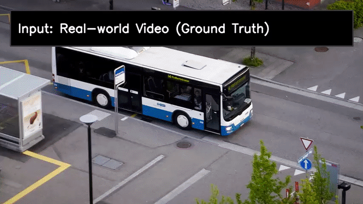
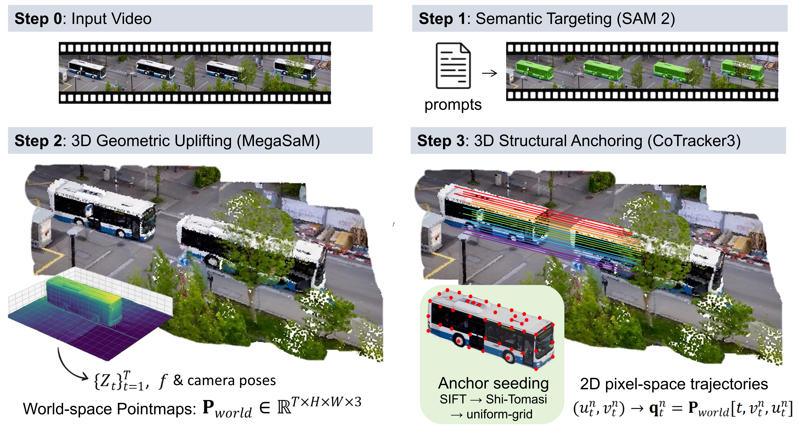

# 6D CAD Deformation Detection

> [!WARNING]
> **UNVERIFIED DEVELOPMENT PIPELINE.** The CAD canonicalization path has not
> yet passed its FoundationPose GPU and held-out threshold-calibration gates.
> Continuous diagnostics are experimental until those gates pass.

This is a standalone, end-to-end extension of PDI-Bench for detecting whether
generated Franka robot links deform relative to their official CAD geometry.
It intentionally reuses the existing perception and PDI stages instead of
reimplementing them.

```text
generated video
  -> SAM3 named link masks
  -> one shared MegaSAM RGB-D/world reconstruction
  -> one shared CoTracker query manifest
  -> existing PDI scale and trajectory metrics
  -> CAD canonicalization for link2 through link7
       -> FoundationPose 6D rigid pose
       -> CAD-relative proportional-shape score
       -> separate pose-discontinuity diagnostic
```

FoundationPose estimates rigid translation and rotation. The deformation
decision comes from the CAD-relative shape metric after that rigid pose is
removed. Pose discontinuity is reported separately and is never treated as
deformation by itself.

## Foundation Model Roles

- **DINOv2** performs reference-conditioned localization independently for each
  canonical Franka link and supplies initial boxes.
- **SAM3** consumes the DINOv2 boxes (plus configured link text where enabled)
  and propagates one isolated video mask session per link.
- **FoundationPose** estimates per-frame `T_C_from_L` 6D rigid transforms from
  the link CAD meshes, RGB, depth, intrinsics, and masks. These poses establish
  the rigid CAD frame used by canonical shape scoring.

SAM3 and DINOv2 run together in an isolated `sam3` environment. The MegaSAM,
Depth Anything, UniDepth, CoTracker, and PDI stages run in the pinned
`pdi-bench` PyTorch 2.1.0/cu118 environment. FoundationPose runs in a third
isolated environment so its compiled CUDA extensions cannot change either
stack.

## Repository Boundary

This repository owns:

- the complete video-level orchestration and artifact contracts;
- the adapted SAM3, MegaSAM, CoTracker, and PDI integration code;
- strict Franka DAE loading and coordinate validation;
- `cad-canonical-v1` proportional-shape scoring;
- `foundationpose-pose-discontinuity-v1` diagnostics;
- configuration, tests, reports, and cache schemas.

The boundaries are deliberate:

- `third_party/mega_sam` remains an upstream Git submodule;
- SAM3 runs in its isolated environment and produces `segmentation.npz`;
- FoundationPose runs in its isolated environment and produces a numeric pose
  archive;
- model checkpoints, videos, caches, and generated results are not source code
  and are excluded from Git;
- there is no runtime import or Git-history dependency on
  `PDIBench_Segment_CAD`. Reused PDI pipeline code is versioned and tested in
  this repository.

The current implementation consumes a validated, pickle-free FoundationPose
archive containing `T_C_from_L`, pose validity and source, optional objective
and residual signals, ordered timestamps, and one positive video depth scale.
The isolated FoundationPose worker that generates this archive, video-global
scale calibration, and pinned held-out thresholds are the next implementation
phase. Until those are ready, the default configuration keeps the legacy PDI
rigidity method active.

See [CAD_BASED_ROBOT_LINK_CANONICALIZATION_DESIGN.md](CAD_BASED_ROBOT_LINK_CANONICALIZATION_DESIGN.md)
for the coordinate, scale, scoring, and validation contracts.

## Native Multi-Object Franka Evaluation

This checkout includes a native video-level pipeline for CAD-guided SAM3 masks,
one shared MegaSAM reconstruction, and per-link PDI metrics. It supports two
CoTracker methods over the same deterministic query manifest:

- `joint-query`: all six scored link groups and shared background in one predictor call;
- `exact-group`: one cached video backbone pass followed by isolated link and
  background update groups.

Run both and emit metric/speed deltas with:

```bash
PYTHONPATH=src python evaluation/run_multi_object.py \
  --config configs/default.yaml \
  --input /path/video.mp4 \
  --segmentation-npz /path/segmentation.npz \
  --output-dir /path/output \
  --geometry-cache-dir /path/cache \
  --tracker-checkpoint /path/scaled_offline.pth \
  --tracking-mode both
```

The union of the six link masks is used only for background exclusion and combined
replay. Rigidity is always calculated independently per rigid link.

The retained PDI metrics quantify spatial scale and perspective consistency in
AI-generated videos. In this project they complement, rather than replace, the
CAD-relative deformation score.





---

## Core Evaluation Logic

### 1. Scale-Depth Alignment (Spatial Dimension, $\epsilon_{scale}$)
- **Core principle**: This term is grounded in the pinhole camera model. In the physical world, an object's **pixel height ($h$) multiplied by its physical depth ($Z$) remains constant** (i.e., $h \cdot Z = f \cdot H$).
- **What it audits**: It measures whether object scale changes during forward/backward motion strictly follow perspective geometry.
- **Hallucinations it captures**: Perspective inconsistency artifacts frequently seen in AI videos, such as "the object moves away but does not shrink" (giant-like drift) or "the object does not move yet suddenly shrinks" (volume collapse).

### 2. Motion Consistency (Temporal Dimension, $\epsilon_{traj}$)
- **Core principle**: This term is based on Newtonian motion (inertia). For macroscopic objects, trajectories in 3D space should be continuous and smooth, with **no abrupt acceleration jumps** and **no unjustified directional reversals**.
- **What it audits**: It directly analyzes centroid motion vectors in 3D world coordinates, quantifying both acceleration discontinuity (magnitude) and turning behavior (directional angle change).
- **Hallucinations it captures**: It is robust to camera shake and specifically detects non-inertial artifacts in AI videos, including high-frequency jitter, instantaneous teleportation, and momentum-violating sharp turn-backs.

### 3. Structural Rigidity (Material Dimension, $\epsilon_{rigidity}$)
- **Core principle**: This term is based on rigid-body invariance. In the physical world, the **3D distance between any two points inside a rigid object should remain constant over time**.
- **What it audits**: Using dense point tracking (CoTracker), it samples multiple 3D anchor pairs within the object and monitors whether their distance ratios remain stable throughout motion.
- **Hallucinations it captures**: It targets the notorious **Jello Effect** in AI videos, detecting local melting, non-physical deformation, and stretching artifacts during motion (e.g., elongated car fronts or warped faces).

The **Perspective Distortion Index (PDI)** is defined as a weighted sum of three orthogonal residuals:

$$
\text{PDI} = w_1 \cdot \mathrm{RMSE}(\epsilon_{scale}) + w_2 \cdot \mathrm{RMSE}(\epsilon_{traj}) + w_3 \cdot \epsilon_{rigidity}
$$

where $\sum_{i=1}^{3} w_i = 1$. Each component is designed to be scale-invariant and to capture a geometrically orthogonal failure mode.

---

## 1. Environment Requirements

This project is highly sensitive to CUDA versions. The following combination is
for the `pdi-bench` environment only; do not install SAM3/DINOv2 or
FoundationPose into it:

- **Python**: 3.10
- **CUDA Toolkit**: 11.8
- **PyTorch**: 2.1.0
- **Conda environment name**: `pdi-bench`

The complete deployment uses three environments:

| Environment | Models/stages | Compatibility boundary |
| --- | --- | --- |
| `pdi-bench` | MegaSAM, Depth Anything, UniDepth, CoTracker, PDI | Python 3.10, PyTorch 2.1.0, CUDA 11.8 |
| `sam3` | SAM3 and DINOv2 | Current SAM3 package and its supported PyTorch CUDA wheels |
| `foundationpose` | FoundationPose and its CUDA extensions | Isolated from both stacks; use the revision recorded by deployment |

On the GPU host, create the FoundationPose environment with the repository-level
installer:

```bash
bash ../scripts/install_foundationpose_gpu.sh
```

This pins the FoundationPose, PyTorch3D, and NVDiffRast revisions and compiles
the model-based CUDA extensions. FoundationPose's upstream scorer and refiner
weights are separate model artifacts and must be placed in the deployed
FoundationPose checkout's `weights/` directory.

Do **not** rely on a system-wide CUDA installation such as `/usr/local/cuda-12.x` or `/usr/local/cuda-13.x`. PDI-Bench should use the CUDA 11.8 toolkit installed inside the conda environment. If your shell startup file (`~/.bashrc`, `~/.zshrc`, etc.) contains a line like the following, remove it or comment it out before continuing:

```bash
export CUDA_HOME=/usr/local/cuda-13.0
```

Also do **not** create the environment from `third_party/mega_sam/environment.yml` or install `third_party/mega_sam/UniDepth/requirements.txt` directly. Those upstream files pin different PyTorch/CUDA versions and can overwrite the version combination above.

---

## 2. Clone the Project and Submodules

This project includes nested submodules: `third_party/mega_sam` itself depends on `third_party/mega_sam/base` (the DROID-SLAM core).

```bash
git clone --recursive https://github.com/Wilsonnijc-bot/6D_CAD_deformation_detection.git
cd 6D_CAD_deformation_detection

# If the main repo is already cloned, initialize submodules recursively (including nested ones)
git submodule update --init --recursive
```

---

## 3. Environment Setup

### 3.1 Create a Conda Environment

```bash
conda create -n pdi-bench python=3.10 -y
conda activate pdi-bench

# Install basic build tools
conda install -c conda-forge gxx_linux-64=11 gcc_linux-64=11 cmake -y

# Install PyTorch (you must specify `index-url`)
pip install torch==2.1.0 torchvision==0.16.0 torchaudio==2.1.0 --index-url https://download.pytorch.org/whl/cu118

# Install the CUDA 11.8 build toolkit inside this conda environment
conda install -c nvidia cuda-nvcc=11.8 cuda-cccl=11.8 cuda-libraries-dev=11.8 cuda-cudart-dev=11.8 libcublas-dev=11.11 -y
```

### 3.2 Configure CUDA for This Conda Environment

```bash
mkdir -p "$CONDA_PREFIX/etc/conda/activate.d"
cat > "$CONDA_PREFIX/etc/conda/activate.d/pdi_bench_cuda.sh" <<'EOF'
export CUDA_HOME="$CONDA_PREFIX"
export PATH="$CUDA_HOME/bin:$PATH"
export LD_LIBRARY_PATH="$CUDA_HOME/lib64:$CONDA_PREFIX/lib/python3.10/site-packages/torch/lib:${LD_LIBRARY_PATH:-}"
EOF

conda deactivate
conda activate pdi-bench
```

Verify that PyTorch and `nvcc` both use CUDA 11.8 from the active conda environment:

```bash
python -c "import os, torch; print('torch:', torch.__version__); print('torch CUDA:', torch.version.cuda); print('CUDA_HOME:', os.environ.get('CUDA_HOME'))"
which nvcc
nvcc --version
```

Expected results:

- `torch CUDA` should be `11.8`.
- `CUDA_HOME` should point to the active conda environment, not `/usr/local/cuda-*`.
- `which nvcc` should point to `$CONDA_PREFIX/bin/nvcc`.

---

## 4. Install Dependencies

### 4.1 Install Basic Python Dependencies

```bash
pip install -r requirements.txt
```

> **Note**: `torch-scatter` and CoTracker are **not** in `requirements.txt` and must be installed separately. SAM3 is installed in its isolated environment by the repository-level `scripts/install_sam3_gpu.sh`.

Install the additional runtime packages used by Mega-SAM and UniDepth without changing the pinned PyTorch/CUDA stack:

```bash
pip install wandb yacs h5py safetensors tabulate
pip install xformers==0.0.22.post7 --no-deps
```

### 4.2 Install CoTracker

```bash
pip install --no-deps git+https://github.com/facebookresearch/co-tracker.git
```

> **Important**: `--no-deps` prevents CoTracker from upgrading the pinned PyTorch/CUDA stack.

### 4.3 Install `torch-scatter` (must force the pt21 build)

> **Important**: Running `pip install torch-scatter` directly may install an older pt20 build and cause `undefined symbol` runtime errors. You must use `--force-reinstall` to ensure the version matches PyTorch 2.1.0.

```bash
pip install torch-scatter --force-reinstall -f https://data.pyg.org/whl/torch-2.1.0+cu118.html
```

Verify installation:
```bash
python -c "from torch_scatter import scatter_sum; print('torch_scatter OK')"
```

Verify the main runtime packages:

```bash
PYTHONPATH=third_party/mega_sam/UniDepth python -c "import xformers; from cotracker.predictor import CoTrackerPredictor; from unidepth.models import UniDepthV2; print('CoTracker / UniDepth OK')"
```

### 4.4 Compile Mega-SAM Low-Level Operators

The DROID-SLAM core of Mega-SAM depends on two CUDA C++ extensions: `droid_backends` and `lietorch`. Run the provided build script from the **project root**:

```bash
conda activate pdi-bench
bash scripts/build_mega_sam.sh
```

The script will build and install both extensions, copy the compiled `.so` files into site-packages, and restore `setup.py` automatically. Upon success you will see:

```
droid_backends OK
lietorch OK
All done.
```

> **Note**: It is normal to see many warnings such as `-Wdeprecated-declarations` and `-Wreorder` during compilation. They do not affect usage. Only lines with `error:` require action.

---

## 5. Download Model Weights

Download the following checkpoint files into the corresponding directories:

### Co-Tracker (CoTracker3 Offline)
```bash
mkdir -p checkpoints/tracker
wget -P checkpoints/tracker https://huggingface.co/facebook/cotracker3/resolve/main/scaled_offline.pth
```

### Mega-SAM: Depth-Anything
```bash
mkdir -p third_party/mega_sam/Depth-Anything/checkpoints
wget -P third_party/mega_sam/Depth-Anything/checkpoints \
  https://huggingface.co/spaces/LiheYoung/Depth-Anything/resolve/main/checkpoints/depth_anything_vitl14.pth
```

### Mega-SAM: megasam_final.pth
```bash
mkdir -p third_party/mega_sam/checkpoints
# Get this file from the official Mega-SAM repository: https://github.com/mega-sam/mega-sam
```

After downloading, the file must exist at:

```bash
test -f third_party/mega_sam/checkpoints/megasam_final.pth && echo "megasam_final.pth OK"
```

### Mega-SAM: RAFT (required for CVD-consistent depth optimization)

> RAFT is required in Step 4 of the full MegaSAM pipeline (CVD pre-flow). If missing, the pipeline will automatically fall back to raw DROID depth, but temporal depth consistency will degrade.

```bash
pip install gdown
cd third_party/mega_sam/cvd_opt/
gdown 1R8m_jMvCun-N45XkMvHlG0P38kXy-h6I
cd ../../../
```

Weight paths are configured in `configs/default.yaml` and can be edited as needed.

Verify all required checkpoint files:

```bash
test -f checkpoints/tracker/scaled_offline.pth && test -f third_party/mega_sam/Depth-Anything/checkpoints/depth_anything_vitl14.pth && test -f third_party/mega_sam/checkpoints/megasam_final.pth && echo "Required checkpoints OK"
```

---

## 6. Download Dataset

The benchmark videos are hosted on Hugging Face: [AnteaWu/PDI-Dataset](https://huggingface.co/datasets/AnteaWu/PDI-Dataset).

### Install Hugging Face Hub CLI

```bash
pip install huggingface_hub
```

### Download Ground Truth Videos Only (Recommended)

```bash
python -c "
from huggingface_hub import snapshot_download
snapshot_download(
    repo_id='AnteaWu/PDI-Dataset',
    repo_type='dataset',
    allow_patterns='GT/**',
    local_dir='videos'
)
"
```

After downloading, the GT videos will be placed under `videos/GT/`, structured as:

```
videos/
  GT/
    Biological_Motion/
    Curved_Motion/
    Dynamic_Tracking/
    Longitudinal_Convergence/
    Partial_Occlusion/
```

### Download All Videos (GT + Generated)

```bash
python -c "
from huggingface_hub import snapshot_download
snapshot_download(
    repo_id='AnteaWu/PDI-Dataset',
    repo_type='dataset',
    local_dir='videos'
)
"
```

---

## 7. Quick Start

Run the native multi-object evaluator after CAD-guided SAM3 has written the
canonical segmentation archive:

```bash
conda activate pdi-bench
PYTHONPATH=src python evaluation/run_multi_object.py \
  --config configs/default.yaml \
  --input your_video.mp4 \
  --segmentation-npz segmentation.npz \
  --output-dir results/your_video \
  --geometry-cache-dir /path/megasam-cache \
  --tracker-checkpoint checkpoints/tracker/scaled_offline.pth \
  --tracking-mode both
```

### Full Argument Reference

| Argument | Default | Description |
| :--- | :--- | :--- |
| `--input` | Required | Input video path |
| `--segmentation-npz` | Required | Canonical SAM3 archive with named object masks |
| `--config` | `configs/default.yaml` | Configuration file path |
| `--output-dir` | Required | Output directory |
| `--geometry-cache-dir` | Required | Shared versioned MegaSAM cache directory |
| `--tracker-checkpoint` | Config value | CoTracker3 offline checkpoint |
| `--tracking-mode` | `both` | `joint-query`, `exact-group`, or `both` |

The old prompt-based `evaluation/main.py` path is retained only as upstream
history and is not part of the active Franka workflow.

---
