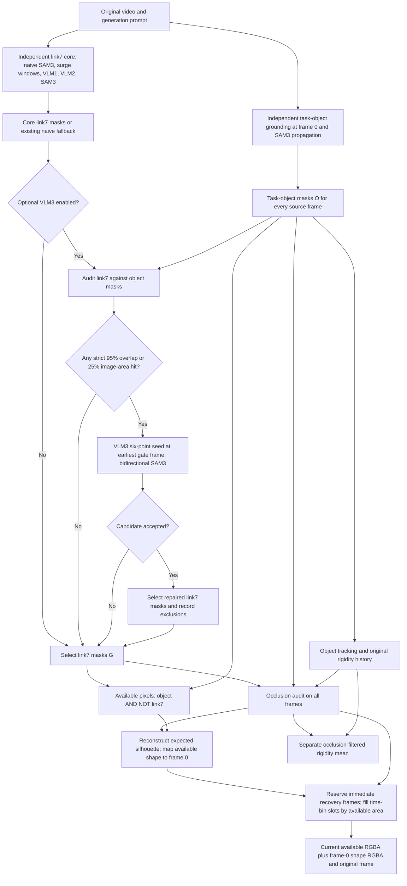
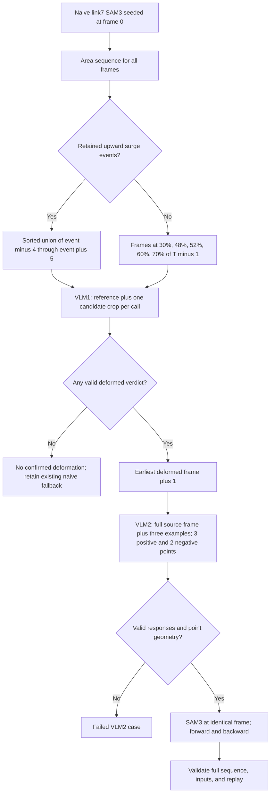
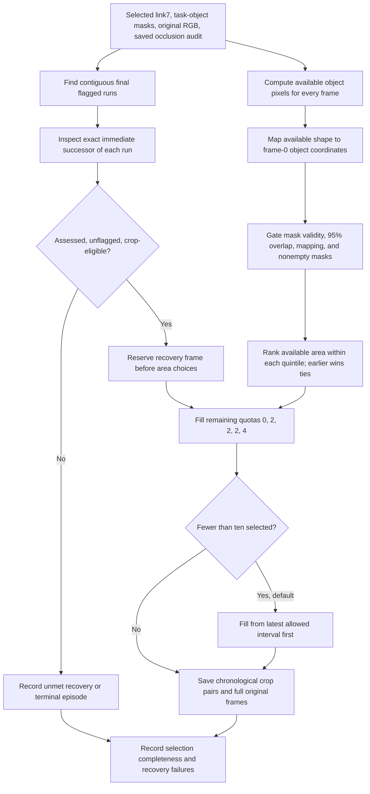

# How link7 persistent masking, object masking, occlusion, and cropping coordinate

Verified against the **current implementation on 2026-10-03**, including the optional VLM3 and crop-selection changes. All frame indices are **zero based**. This document describes executable behavior; older specifications differ in several places listed at the end.

## 1. Architecture and dependencies

**The core link7 persistent-masking pipeline can run independently of task-object masking. Optional VLM3 repair is the coupling point: it needs both the link7 masks and the task-object masks. Occlusion and available-pixel cropping then consume the selected link7 mask together with the object masks.**

The intended separation is already reflected in the implementation:

| Component | Inputs | Output | Dependency on task-object masks |
|---|---|---|---|
| Core persistent link7 masking | Original video, DINO gripper references, VLM1 comparison reference, three VLM2 examples | Full-video link7 masks from naive SAM3 or VLM-guided reseeding | None |
| Task-object masking | Original video, generation prompt | Full-video `task_object` SAM3 masks | Generates them independently |
| Optional VLM3 | Selected link7 masks, task-object masks and name, original video, six-point example | Repaired link7 masks and per-frame crop exclusions | Required |
| Object tracking / rigidity | Original full-frame video, object masks, shared geometry | Object tracks, visibility, rigidity history | Required; core link7 masking is independent |
| Occlusion detection | Selected link7 masks, object masks, object tracks and anchor visibility | Per-frame measurements and final occlusion flags | Required |
| Available-pixel export | Selected link7 masks, object masks, saved occlusion audit, source RGB | Available object pixels and corresponding frame-0 shapes | Required |
| Crop-frame selection | Available-pixel manifest, saved occlusion audit | Normally ten current/reference crop pairs | Required through saved artifacts |



This chart expresses data dependencies, not a single automatic end-to-end command. In particular, generating a VLM3 candidate does **not** automatically update previously saved gripper archives, occlusion audits, or crops. Section 6 explains the required handoff.

VLM1 diagnoses **palm deformation**, using naive mask-area surges to nominate suspicious frames. It does not directly classify whether a mask has lost the gripper. Thus “likely frames of losing the mask” is a useful motivation for the surge heuristic, but not the literal VLM1 verdict.

## 2. Exact frame-selection ledger

Let `T` be the source frame count, `t ∈ {0, …, T−1}`, `N[t]` the naive link7 mask, `G[t]` the selected link7 mask, and `O[t]` the task-object mask. Every array uses the original source-video frame order and image grid.

| Step | Exact frame rule | When it cannot proceed |
|---|---|---|
| Naive link7 SAM3 seed | Frame **0** | No initial candidate or incomplete propagation |
| Surge event | Scan `t=1…T−1`; retain upward log-area changes `>=0.25`, separated from the last accepted event by `max(1, round(0.5*FPS))` | No events invokes the five-frame VLM1 fallback below |
| VLM1 candidates with surges | Union of **event−4 through event+5**, clipped to video bounds, deduplicated, sorted | Unreadable input / invalid prepared run |
| VLM1 candidates without surges | Sorted unique `round((T−1)*p)` for `p=[0.30,0.48,0.52,0.60,0.70]`, clamped to bounds | Candidates can collapse to fewer than five on short videos |
| VLM1 comparison reference | Existing case `inputs/reference.png`; otherwise original **frame 0**, cropped using `N[0]` or full frame if empty | An existing reference is reused as an image; its source index is not reselected by this runner |
| First VLM1 input artifact | First / earliest selected candidate; the exact diagnosis **crop** | Does not imply this frame was diagnosed deformed |
| VLM2 placement and corrected SAM3 seed | **Earliest valid VLM1-deformed frame + 1** | No confirmed deformation, out-of-range successor, or invalid points |
| VLM2 alternate-model attempt | **Same reseeding frame**, same target and three examples | One shared alternate request budget per case |
| Task-object grounding and SAM3 seed | Original **frame 0**, for both primary and fallback models | Both model/SAM attempts fail |
| VLM3 seed | **Earliest frame satisfying either enabled gate**, with **no +1** | No gate hit, invalid points, or unacceptable repaired sequence |
| VLM3 retry | Same original gate frame; default at most **two** attempts total | No move to the next gate frame |
| Initial occlusion reference | Earliest frame with valid link7 area, nonempty `O[t]`, and direct object/link7 overlap **≤5%** | No such frame: no assessable reference |
| Occlusion reference refresh | Current frame becomes the reference for later frames when overlap ≤5%, replacement ≤5%, and area ratio is in `[0.8,1.25]` | Otherwise keep previous reference |
| Crop comparison RGB reference | Always original **frame 0** | Empty frame-0 object mask stops export; invalid or >5%-overlapped frame 0 prevents usable reference mapping |
| Mandatory crop frames | Exact **immediate unflagged successor** of each final flagged run, if assessed and crop-eligible | Report invalid immediate successor; never advance to a later frame |
| Ordinary crop frames | Time quintiles, quotas `[0,2,2,2,4]` for ten slots; descending available pixel area within each interval, earlier frame wins ties | Explicit fallback or shortfall; no duplicates |

Python `round()` is used in surge separation and no-surge frame selection, including its ties-to-even behavior. Quintile boundaries use integer division, not `round()`.

## 3. Standalone core link7 persistent masking

Sources: [naive_sam3.py](../persistent_masking/naive_sam3.py), [pipeline.py](../persistent_masking/pipeline.py), [palm_recovery.py](../persistent_masking/palm_recovery.py), [frame_lineage.py](../persistent_masking/frame_lineage.py), [vlm2_sam_prompting.py](../persistent_masking/vlm2_sam_prompting.py), and [gripper_review.py](../persistent_masking/gripper_review.py).

### 3.1 Naive initialization: one prompt at frame 0

The default `reference-box` initializer applies the existing DINOv2 gripper-reference localization to the **first original frame**. SAM3 receives one positive reference box with `text="visual"`. An optional text-only initializer instead uses `"robot gripper"`.

At frame 0, select the candidate with the highest SAM3 probability (`np.argmax(out_probs)`). Keep that object ID and propagate **forward** through the complete video. Missing appearances of that ID remain empty masks. Save `naive/<case>/masks.npz` and its areas/provenance.

This pass supplies temporal event evidence and a fallback mask sequence. It is not a VLM correction, and its frame selection is always 0.

### 3.2 Surge detection: upward growth, not arbitrary mask change

`pipeline.surge_windows()` implements:

```python
A[t] = number_of_true_pixels(N[t])
separation = max(1, round(FPS * 0.5))

for t in range(1, T):
    ratio = max(A[t], 1) / max(A[t - 1], 1)
    if log(ratio) >= 0.25:
        if no_previous_event or t - last_accepted_event >= separation:
            accept_event(t)
```

The raw area ratio threshold is approximately `exp(0.25)=1.284`, or 28.4% growth when both areas are positive. The `max(area,1)` floor handles zero masks. A zero-to-positive recovery can qualify if it exceeds the same threshold.

For a retained transition `t−1 → t`, save:

- `event_frame = t`: the **later** frame.
- `surge_frame = t−1`: the **earlier** frame.
- Original before/after areas and their floored ratio.

The scan accepts the earliest eligible change after each separation period; it does not pick the largest change in that period, and there is no two-event cap. Falling area alone does not trigger this active detector. A monotonically shrinking or consistently wrong mask may therefore have no surge.

### 3.3 VLM1 candidate frames and crops

With retained events, the exact candidate list is:

```python
frames = sorted({
    f
    for event in events
    for f in range(max(0, event_frame - 4), min(T, event_frame + 6))
})
```

An event at 12 produces frames **8…17**, inclusive, before union/deduplication. It does not start at `surge_frame` and does not choose only frames after the event.

With **no events**, diagnose the following instead:

```python
frames = sorted({
    max(0, min(T - 1, round((T - 1) * p)))
    for p in [0.30, 0.48, 0.52, 0.60, 0.70]
})
```

For `T=49`, this is **[14,23,25,29,34]**. The current no-surge path still invokes VLM1. Consequently, the retained `no_naive_surge` status is not the ordinary outcome of a valid current no-event run.

For each candidate `f`, VLM1 sees **one fixed comparison reference plus one clean RGB candidate crop**. The crop support is the union of naive masks:

```python
support = N[max(0, f - 4):f + 1].any(axis=0)
```

If that union is empty, use `N[0]`; if still empty, use full-frame RGB. Otherwise:

1. Find the support bounding-box width/height.
2. Do not shrink those dimensions below frame-0 support counts: `N[0].any(axis=0).sum()` occupied columns and `N[0].any(axis=1).sum()` occupied rows. These are not necessarily the bounding-box extent for disconnected support.
3. Use a centered context box with width/height `max(160, ceil(2*dimension))`.
4. Clamp the box to the source image. Boundary clipping can make the final crop smaller than 160 pixels.

Reference selection first tries `<reference-root>/<case>/inputs/reference.png`. If absent, crop original frame 0 with the same `crop_box()` helper applied to `N[0]`, or use full-frame RGB if empty. A preexisting image is not a freshly validated normal frame; the prompt explicitly treats frame 0 as a comparison reference rather than guaranteed normal geometry.

VLM1 runs once per sorted candidate, with the same reference. It assesses the **rigid gripper palm**, excluding wrist, held object, and normal finger articulation. Visibility failure means `unclear` and null probability. For an evaluable target the prompt requires `deformed` at probability **≥0.5**, otherwise `normal`; inconsistent parsed responses are rejected. Selection only admits `state="deformed"` with no parse error.

### 3.4 VLM2: earliest confirmed deformation + 1

Let:

```python
d = min(r["frame"] for r in diagnoses
        if r["state"] == "deformed" and not r.get("parse_error"))
reseed_frame = d + 1
```

No valid deformed frame produces `no_confirmed_deformation`; no VLM2 correction is fabricated. If `d+1 >= T`, the runner records `reseed_frame_unavailable`.

Read `reseed_frame` directly from the original source video. VLM2 receives exactly **four images**:

1. The full, unmasked original RGB reseeding frame.
2. Three annotated point-placement examples, in their recorded order.

VLM1's comparison reference and candidate crops are not VLM2 inputs. VLM2 makes two point requests on these same four images:

| Request | Points in order |
|---|---|
| Positive | Two distinct dark gripper interiors, then white gripper palm: exactly **3** positives |
| Negative | Forearm elbow-side half, then upper wrist edge: exactly **2** negatives |

The five-point SAM3 seed has labels `[1,1,1,0,0]`. VLM2 points use integer coordinates in `[0,1000]`, converted to source pixels by `[x/1000*W, y/1000*H]`. Coordinates that land outside the image, including boundary value 1000, fail. Every pair of points must be at least **5 source pixels** apart.

**Current retry logic:** `run_case()` uses `fallback_on_null=True` for positives and a shared `remaining=1` alternate-model budget. A primary positive null or malformed response invokes the configured alternate model on **the same frame and images**. A negative schema failure can use that alternate budget only if it has not already been consumed. A valid primary run makes two calls; a successful fallback run makes at most three. A later geometric validation failure does not itself trigger another frame or another model call.

There is **no active loop over later VLM1-deformed frames**. Although `resolve_frames()` supports a `deformed_rank` parameter, the current runner calls it only with the default rank 0.

### 3.5 Corrected SAM3 propagation and acceptance

Start a **new SAM3 session** on the original video. Apply the five points at exactly `reseed_frame`, then propagate:

- Forward for `T−reseed_frame−1` frames.
- Backward for `reseed_frame` frames.

This produces a new full-video sequence, not a splice that only patches a surge window. The active runner passes `checkpoint=0`; historical 50%/75% review paths in `gripper_review.py` are not invoked.

The runner verifies source-frame lineage, exact VLM2 input hashes, mask dimensions, point-preview presence, and complete replay decoding. Any empty output mask prevents `completed_checks`.

**Five-point membership is diagnostic, not an acceptance gate in this core path.** The recorded `membership_ok` may be false while the run has `completed_checks`. That status establishes the implemented checks passed, not that the mask selects the right semantic object. Optional VLM3 has stricter point-membership acceptance.



The VLM2 box represents its bounded same-frame alternate-model handling. It never moves the seed to a later deformation frame.

## 4. Task-object masking and the tracks needed by occlusion

Sources: [segment.py](../src/pdi_eval/object_deformation_wrapper/segment.py), [prompting.py](../src/pdi_eval/object_deformation_wrapper/prompting.py), and [score.py](../src/pdi_eval/object_deformation_wrapper/score.py).

### 4.1 Ground and segment the object at frame 0

The object branch reads the generation prompt to identify the object directly manipulated by the robot. It always sends the **original first frame** to the grounding model; it does not wait for contact or seek a frame of maximum object area.

The current attempt order is `gpt-6-luna`, then at most one `gemini-3.8-flash` attempt after failure. Both use the **same frame 0**. These object-grounding calls are separate from the persistent-mask roles called VLM1, VLM2, and VLM3.

Each successful grounding supplies one object name, one positive bounding box, and one positive point. SAM3 then:

1. Seeds the positive box at frame 0.
2. Selects the highest-probability nonempty candidate containing the positive point.
3. Propagates forward over all frames to prime the point-prompt video cache.
4. Adds the positive point at **frame 0**, using the selected object ID.
5. Checks the refined frame-0 mask contains the point.
6. Propagates forward over the complete video again and saves that refined sequence.

Every source frame must be returned, but later empty masks are recorded rather than automatically failing object masking. There are no subsequent VLM correction frames in this branch. The fallback loop catches failures from grounding and SAM processing; it is not a retry on a different source frame.

The archive is `masking/segmentation.npz`, with `object_masks[:,0]`, `object_names=["task_object"]`, and preserved source video/hash information in `grounding.json`.

### 4.2 Object tracks are an additional occlusion input

Object scoring prepares CoTracker queries from the **frame-0 object mask**, requests 100 foreground queries, and uses `exact-group` tracking. A score requires at least five retained object tracks and sufficient nondegenerate 3D-pair evidence. MegaSAM runs on the original full-frame video, not on the object crops.

Occlusion reads the saved object tracks in source-video pixel coordinates. It does not use VLM judgments or rigidity values to pick its reference frame. Rigidity values and carried-frame markers are appended for reporting only.

For the current `occlusion.process()` entry point, saved tracks and `score/rigidity.json` must exist, even though the detection verdict itself does not depend on rigidity scores.

## 5. Optional VLM3: object-aware gripper remasking

Source: [vlm3_overmask.py](../persistent_masking/vlm3_overmask.py), especially `audit_gate()`, `repair_case()`, `parse_points()`, `crop_policy()`, and `repair_persistent_run()`.

### 5.1 Exact trigger and exact seed frame

For every frame compute:

```python
object_area[t] = |O[t]|
covered_fraction[t] = |O[t] & G[t]| / max(1, |O[t]|)
overlap_hit[t] = object_area[t] > 0 and covered_fraction[t] > 0.95
oversized_hit[t] = |G[t]| / (H * W) >= 0.25
gate_frame = earliest t where overlap_hit[t] or oversized_hit[t]
```

The main overlap denominator is the **current task-object mask**, not link7 area and not an expected full-object silhouette. Exactly **95% does not trigger**. Empty object masks do not trigger overlap.

By default the existing **25% image-area guard is a second independent trigger**, so an oversized link7 mask can nominate an earlier frame than the first >95% overlap. The standalone CLI supports `--overlap-only`; the integrated persistent-run stage uses both gates by default.

If no hit exists, record `not_triggered` and make no VLM3/SAM3 correction. If there is a hit, VLM3 and SAM3 use **that exact original frame**. There is **no +1 offset** and no return to VLM1 to select another frame.

### 5.2 VLM3 regenerates all six points

VLM3 is a workflow role using `role_config("vlm2")`, not a separately configured model. It sees two images: the exact full original gate frame and an annotated six-point reference. The prompt includes the task-object name and, when available, its normalized mask bounding-box hint.

It generates a fresh combined request containing:

- Three positives: two distinct dark gripper interiors and the white palm.
- Three negatives: forearm, wrist, and **deep inside the visible task object**.

Thus it does more than append an object-negative to the old five-point seed. It creates a **new six-point seed**, labels `[1,1,1,0,0,0]`, and starts another SAM3 session with forward and backward full-video propagation.

Before SAM3, all six points must satisfy normalized coordinate and ≥5-pixel spacing checks. Each positive must be **outside the existing task-object mask**, and the third negative must be **inside it**. The other anatomical roles are requested by the prompt rather than verified against separate forearm/wrist ground-truth masks.

### 5.3 Retries, acceptance, and residual failures

Default: at most **two attempts total**, both on the same `gate_frame` with the same two images. A failed point/schema or SAM candidate produces feedback for the next attempt. The standalone CLI allows one to three attempts via `--max-attempts`. VLM3 does not invoke the VLM2 alternate-model helper.

After propagation, rerun the gates over the whole candidate sequence. Define:

```python
crop_excluded_frames = union(
    remaining_overlap_hits,
    remaining_oversized_hits,
    empty_repaired_link7_frames,
    empty_task_object_frames,
)
crop_eligible_frames = all_frames - crop_excluded_frames
accepted = six_point_membership_ok and no_empty_link7_frames and bool(crop_eligible_frames)
```

“Eligible” here means eligible under the **VLM3 repair policy** only. Mapping, frame-0 reference quality, and crop-selection rules still apply later.

Residual overlap or area failures do **not** reject an otherwise accepted video. They produce `accepted_with_frame_exclusions`. An accepted sequence with no exclusions is `accepted`. Failed attempts leave the previous selected masks available; their candidates are not automatically promoted.

The six-point membership check uses the resulting seed-frame mask and must match `[true,true,true,false,false,false]`. Unlike the core five-point path, this is a required acceptance gate.

The optional integrated stage also audits naive fallback masks when the core result is `no_confirmed_deformation` or the retained historical `no_naive_surge` status. VLM1's lack of a deformation verdict does not suppress VLM3. Other failed core statuses are skipped. An already attached `vlm3` record is skipped rather than implicitly retried.

## 6. Selecting repaired link7 masks for downstream consumers

Source: [mask_merge.py](../src/pdi_eval/experiment/mask_merge.py), `build_refined_segmentation()`; the recorded experiment handoff is [crop_results.py](../../results/vlm3-overmask-20261002/metadata/vlm3_fresh/execution/crop_results.py).

The persistent runner attaches a separate `vlm3` provenance record. `mask_merge` chooses a hash-verified accepted VLM3 sequence when present; otherwise a `completed_checks` core sequence. An accepted VLM3 sequence can also be merged for the permitted naive-fallback statuses.

The merge replaces only the named **link7 channel** in a **new** multi-link segmentation archive. It preserves other link channels and identities, then recomputes the union mask and union measurements. It refuses an existing output archive.

This matters because the occlusion CLI reads this fixed path:

```text
<gripper-root>/cases/<case>/v1_cotracker3/segmentation.npz
```

It does not discover the latest VLM3 `masks.npz` by itself. The crop exporter in turn reads the gripper path/hash stored in the saved occlusion audit. Merely generating a repair or editing a status file does not change those consumers' selected inputs.

To use a repair coherently:

1. Select the accepted repair and materialize it as link7 in a new gripper archive at the downstream expected location.
2. Use the matching original task-object masks, source video, and saved object tracks.
3. Rerun occlusion on the selected gripper archive.
4. Re-export available pixels and frame-0 mappings from that new audit.
5. Rerun crop selection and regenerate its paired PNGs.
6. Recompute a separate filtered score if that output is needed; recompute crop-based anomaly scores if their input pairs changed.

The recorded fresh-LVP experiment followed this sequence in isolated inputs, reusing unchanged object masks/tracks and original rigidity scores.

**Exclusions are not applied by deleting mask frames.** The merged archive remains a complete sequence. `vlm3.crop_excluded_frames` is recorded, while current crop eligibility is recomputed from the selected masks/audit. The generic selector does not directly read `repair.json` or its arbitrary exclusion list. At defaults, its >95% overlap and area gates reject the residual failures; empty object masks cannot yield usable available pixels, and accepted VLM3 output has no empty link7 frames.

Changing VLM3's overlap threshold or disabling its area trigger does not change the selector's hardcoded 95% cutoff or the occlusion guard automatically. Record and reconcile such settings before treating the exclusion lists as interchangeable.

## 7. Occlusion detection: all frames, translated reference, two temporal branches

Source: [occlusion.py](../src/pdi_eval/object_deformation_wrapper/occlusion.py), `Config`, `align()`, and `detect()`; shared area rule: [mask_quality.py](../src/pdi_eval/perception/mask_quality.py). Current method: **`gripper-occlusion-v2`**.

### 7.1 Validate link7 and select the reference silhouette

First mark link7 invalid when its **true mask pixel area** is at least 25% of the source image. Such a frame has `mask_valid=false`, status `failed_link7_mask_area`, supplies no occlusion evidence/reference, and resets both episode states. Equality fails. The CLI can configure this cutoff.

The initial reference is:

```python
anchor = earliest t where:
    link7_area_valid[t]
    and |O[t]| > 0
    and |O[t] & G[t]| / |O[t]| <= 0.05
```

Earlier frames have insufficient reference unless independently failed by the area guard. If no clean reference exists, no reference-based verdict is possible. This reference may be later than frame 0; it is distinct from the crop RGB reference, which stays at frame 0.

Tightly crop the anchor object's binary silhouette. At every subsequent frame, translate that template near the current object's centroid:

- Search bounds: approximately `centroid ± 1.5*template_width/height`, clipped to the image; upper bounds add one pixel.
- Pixel evidence: **+1** for current object pixels, **0** for gripper-only pixels, **−1** elsewhere.
- Placement: maximum `cv2.matchTemplate(..., TM_CCORR)` score.

The resulting `E[t]` is the expected silhouette. It preserves template shape and area: no rotation, scaling, dilation, or bounding-box filling. Empty current object or a search region too small to fit the template yields `insufficient_visible_object` and resets both branches.

After evaluating a frame, refresh the anchor to that frame only when:

```text
direct current object/link7 overlap <= 5%
gripper-replaced expected fraction <= 5%
0.8 <= current object area / expected area <= 1.25
```

Refresh affects later frames. It is not conditional on enough tracks or `status="assessed"`; the low-contact and area conditions control it. During contact the template normally remains frozen.

### 7.2 Measurements and assessability

For each aligned frame:

```text
L = E AND NOT O                    missing expected object pixels
C = L AND G                       missing pixels occupied by link7
lost_fraction = |L| / |E|
occluded_fraction = |C| / |E|
explained_fraction = |C| / max(1, |L|)
visible_support = |E AND O| / |E|
expected_gripper_contact = |E AND G| / |E|
```

These differ from VLM3's direct overlap fraction. `O AND G` alone cannot establish an occlusion episode because it may be segmentation leakage onto still-visible object pixels.

At the current reference frame `anchor`, eligible tracks are those that are visible there and whose rounded coordinates fall inside `O[anchor] AND NOT G[anchor]`. Fix that set until the anchor changes:

```text
track_fraction = eligible tracks whose current coordinates land in G[t]
                 / max(1, number of eligible tracks)
assessable = visible_support >= 15% AND eligible_track_count >= 5
```

Sampling uses `np.rint`; nonfinite/out-of-image coordinates are misses. **Current** tracker visibility does not remove tracks from either numerator or denominator. Visibility loss is not independently an occlusion gate.

### 7.3 Exact temporal decisions

| Decision | Default required conditions |
|---|---|
| Legacy onset | Assessable; replacement `>=20%`; explanation `>=60%`; anchor-track overlap `>=20%` |
| Legacy continuation | Previous legacy candidate; assessable; total expected/gripper contact `>=20%`; anchor-track overlap `>=20%` |
| Legacy final flag | Candidate belongs to a contiguous run of at least **2** frames |
| Severity onset | Assessable; replacement `>=20%`; explanation `>=80%`; either track overlap `>=10%` **or** replacement `>=50%` |
| Severity continuation | Previous severity candidate; assessable; replacement `>=20%`; explanation `>=80%` |
| Severity final flag | Candidate belongs to a contiguous run of at least **3** frames |
| Final occlusion flag | `legacy_flagged OR severity_flagged` |

The legacy continuation permits object-mask regrowth because its contact numerator includes current object/gripper overlap. Severity continuation still requires missing-pixel replacement. The states are independent; one branch cannot initiate the other's continuation.

Filter each branch's runs **before** OR-ing their surviving flags. All frames of a surviving run, including its onset, become flagged. There is no gap bridging or padding before onset. A failed/unassessable frame breaks the relevant candidate state. Unflagged does not necessarily mean assessed or reliable.

### 7.4 Different uses of the final flags

The crop selector uses final `flagged` runs to reserve immediate recovery frames. It does **not** globally exclude flagged frames from ordinary crop slots.

The separate [occlusion_scores.py](../src/pdi_eval/object_deformation_wrapper/occlusion_scores.py) consumer averages original `rigidity_history[1:]` after excluding final flagged frames and failed-area masks. It keeps other unassessable and carried values, uses null for excluded values, and returns a null final score when nothing remains. It does not independently exclude every >95% direct-overlap frame.

Thus score retention, available-pixel mapping, and crop eligibility are distinct policies.

## 8. Cropping available pixels and mapping the same visible shape to frame 0

Source: [reference_visible_pixels.py](../src/pdi_eval/object_deformation_wrapper/reference_visible_pixels.py), especially `available_pure_object()`, `map_available_to_frame0()`, and `export_case()`.

### 8.1 Current available-pixel definition

For a valid link7-area frame:

```python
available[t] = O[t] & ~G[t]
```

For a failed-area link7 frame, the exporter empties `available[t]`.

The **current crop** uses actual source RGB from frame `t`, with alpha 255 exactly at available mask pixels and zero elsewhere, tightly bounded by the available mask's box. It preserves disjoint regions and holes. No hidden pixels are reconstructed and no rectangular region is treated as fully visible object.

The exporter can retain available masks/mappings on >95%-overlap frames for inspection; the **selector** excludes those frames. The exporter also does not suppress available pixels just because an occlusion flag is true.

### 8.2 Frame-0 reference and mapping rule

Original frame 0 must have a nonempty task-object mask. Its reference is usable only when link7 passes the area guard and frame-0 direct object/link7 overlap is **≤5%**. A contaminated reference does not cause automatic selection of a later RGB reference.

For each `t` whose saved audit has `expected_area`:

1. Read the audit's `reference_frame` for `t`.
2. Reconstruct `E[t]` with the same `align(crop(O[anchor]), O[t], G[t])` function.
3. Check its area equals the saved `expected_area`.
4. Crop `available[t]` to the **bounding box of E[t]**.
5. Resize that binary region to the bounding-box dimensions of `O[0]`, using nearest-neighbor interpolation.
6. Intersect with the cropped frame-0 object mask.

The paired **frame-0 shape crop** always uses **frame-0 RGB** under this mapped alpha mask. Later-frame RGB is not pasted into the reference.

The coverage gate measures:

```python
coverage = available_pixels_inside_expected_bbox / max(1, total_available_pixels)
```

This is coverage inside the expected silhouette's **bounding box**, not a requirement that those available pixels intersect its exact binary silhouette.

The exporter sets `mapping_status="mapped"` only when:

- Current link7 mask passes its area validity checks.
- Frame-0 reference quality is `clean_low_contact`.
- A reconstructable expected silhouette exists.
- Current available area is positive.
- At least **80%** of available pixels lie inside the expected-full-object bounding box.

It may set `mapped` even when nearest-neighbor mapping/clipping leaves zero reference pixels; the selector separately requires `mapped_reference_area > 0`. Conversely, a detector row with `status="insufficient_support"` can still have an expected silhouette and a valid crop mapping.

This is silhouette/bounding-box registration. It does not guarantee that paired pixels are the same material points through rotation, deformation, or incorrect segmentation.

## 9. Exact selection of the normally ten crop pairs

Source: [frame_selection.py](../src/pdi_eval/object_deformation_wrapper/frame_selection.py), `select_frames()` and `select_case()`. Method: **`time-quintiles-with-post-occlusion-v3`**.

### 9.1 Per-frame eligibility

The selector's implemented gates are:

```python
eligible[t] = (
    crop_row.get("mask_valid", True)
    and detection_row.get("mask_valid", True)
    and not crop_row.get("link7_overmask", False)
    and detection_row.get("mask_overlap_fraction",
                          crop_row.get("link7_object_covered_fraction", 0)) <= 0.95
    and crop_row["mapping_status"] == "mapped"
    and crop_row["available_area"] > 0
    and crop_row.get("mapped_reference_area", 0) > 0
)
```

With current artifacts, this means valid link7 area, direct object overlap **≤95%**, usable frame-0 mapping, and nonempty current/reference masks.

There is **no minimum 20% object-availability rule**. A tiny nonzero crop below or equal to 95% overlap can remain eligible. There is also no ordinary eligibility requirement for `flagged=false` or `status="assessed"`. Those two conditions are required specifically for recovery reservations.

### 9.2 Time intervals and quotas

For `count=10`:

```python
bucket(t) = min(4, (5 * t) // T)
quotas = [0, 2, 2, 2, 4]
interval_b = [ceil(b*T/5), ceil((b+1)*T/5))
```

| Interval | Duration position | Ordinary slots | For T=49: source indices |
|---|---|---:|---|
| 1 | 0–20% | 0 | 0–9 |
| 2 | 20–40% | 2 | 10–19 |
| 3 | 40–60% | 2 | 20–29 |
| 4 | 60–80% | 2 | 30–39 |
| 5 | 80–100% | 4 | 40–48 |

Frame position is `100*t/T`, not `100*t/(T−1)`. The last frame therefore lies below 100%. The CLI also supports 5 or 20 slots with quotas `[0,1,1,1,2]` or `[0,4,4,4,8]` respectively.

### 9.3 Reserve immediate post-occlusion frames first

Scan the **final union flags**, not unfiltered `candidate` rows. For each contiguous flagged run `[start,end]`, examine exactly `s=end+1`:

| Immediate successor | Recorded outcome |
|---|---|
| Within video, unflagged, valid mask, `status="assessed"`, and crop-eligible | Reserve `s`, reason `immediate_post_occlusion` |
| Failed mask or status other than `assessed` | `successor_not_assessable` |
| Assessed but crop-ineligible, including >95% overlap | `successor_crop_invalid` |
| Run reaches the last source frame | `occlusion_reaches_video_end`; no successor |

Never replace an unusable immediate successor with a later frame. An unflagged but unassessable successor does not establish that occlusion disappeared.

Reservations consume their own interval quotas before ordinary area selection. A required successor in the first 20% overrides that interval's ordinary zero quota. If reservations exceed an interval's quota, retain them; ordinary slots fill in chronological interval order up to the total requested count. More mandatory recoveries than total slots raises an explicit conflict.

### 9.4 Fill by available area, then apply bounded fallback

Within **each** interval, sort eligible frames by:

```python
(-available_area[t], t)
```

Fill the interval's remaining quota from this ordering, excluding frames already reserved/chosen. There is no whole-video area ranking, minimum time spacing, or minimum area difference. Adjacent frames can both be selected.

If the total is still short and `--strict-bins` is not enabled, fill from unused eligible frames in this order:

```text
80–100% -> 60–80% -> 40–60% -> 20–40%
```

Each donor interval retains its own area ordering. Never use the first 20% as ordinary fallback. If fewer eligible frames remain than required, report a shortfall without duplication. With `--strict-bins`, skip this fallback and leave missing slots empty.

Save selected frames in chronological order. `status="complete"` requires the requested count **and** no `successor_not_assessable` / `successor_crop_invalid` episodes. A terminal occlusion episode has no successor requirement and is not itself counted as one of those failures. Successful interval fallback can still yield `complete`.



## 10. Actual saved frame lineage: fresh LVP examples

These examples were checked directly against saved native provenance, VLM3 repair records, updated occlusion audits, and crop selections. They illustrate the current rules rather than define new thresholds.

| Stage | LVP_ROBOWM_0010 | LVP_ROBOWM_0015 |
|---|---|---|
| Source frames | 49 | 49 |
| Naive upward surge events | None | None |
| VLM1 no-surge candidate list | `[14,23,25,29,34]` | `[14,23,25,29,34]` |
| Valid VLM1-deformed frames | `[25,29,34]` | `[23,25,29]` |
| VLM2 / core SAM3 frame | **26** | **24** |
| Optional VLM3 / remask frame | **0** | **0** |
| VLM3 acceptance | `accepted_with_frame_exclusions` | `accepted` |
| VLM3 crop exclusions | `[45,46,47,48]` | `[]` |
| Updated final occlusion runs | `[21,22]`, `[39,41]` | `[20,44]` |
| Required immediate successors | **23,42** | **45** |
| Mapped frames before selector gates | 49/49 | 48/49 |
| Selected crop frames | `[10,13,23,29,30,31,40,41,42,43]` | `[11,13,20,21,38,39,45,46,47,48]` |

VLM3 can legitimately seed **earlier** than VLM2: the core reseeds at the earliest diagnosed deformation plus one, while VLM3 independently selects the first mask-overlap/area failure across the propagated sequence.

For LVP0010, mapped status exists even on the four residual >95% frames, but the selector excludes them. It fills the deficient final interval from permitted earlier intervals.

Its mandatory frame **42** has **24 available pixels**, direct link7 coverage **94.1606%**, 22 available pixels inside the expected bounding box, and 22 mapped reference pixels. Coverage is `22/24=91.67%`, above the 80% mapping gate. It therefore remains selected under the current rules. The earlier proposed 20% availability gate is not implemented.

Flagged frames can also appear in selections: LVP0010 frames 40–41 and LVP0015 frames 20–21 and 38–39 are examples of area-ranked available-pixel crops from final occlusion episodes.

Evidence:

- [Native VLM1/VLM2 provenance](../../results/vlm3-overmask-20261002/metadata/lvp_rerun/work/provenance.json).
- [LVP0010 fresh VLM3 record](../../results/vlm3-overmask-20261002/LVP_ROBOWM_0010/vlm3_fresh/repair.json) and [selection](../../results/vlm3-overmask-20261002/crops/LVP_ROBOWM_0010/selection.json).
- [LVP0015 fresh VLM3 record](../../results/vlm3-overmask-20261002/LVP_ROBOWM_0015/vlm3_fresh/repair.json) and [selection](../../results/vlm3-overmask-20261002/crops/LVP_ROBOWM_0015/selection.json).
- [Fresh occlusion/crop summary](../../results/vlm3-overmask-20261002/metadata/vlm3_fresh/crop_summary.json).

## 11. Artifacts and operational order

### 11.1 Data contracts

| Artifact | Information passed to the next stage |
|---|---|
| Persistent `provenance.json` | Video identity, naive events, VLM1 candidates/diagnoses, exact VLM2 frame/calls, selected mask hashes, optional VLM3 record |
| Persistent `sam/<case>/seed_masks.npz` | Core corrected full-video `masks[T,H,W]` |
| VLM3 `repair.json` and `masks.npz` | Accepted candidate identity, exact gate frame, attempts/points, post-gates, excluded frames, repaired full-video masks |
| Merged gripper `segmentation.npz` | Canonical named `object_masks[T,N,H,W]`; link7 replaced while other links remain intact |
| Object `masking/{grounding.json,segmentation.npz}` | Task-object identity, frame-0 grounding, video/hash/grid identity, `object_masks[:,0]` |
| Object `score/cotracker_exact-group.npz` | Task-object tracks and visibility in source pixel coordinates |
| Object `occlusion/{detection.json,frames.csv}` | Actual selected input paths/hashes, reference frame per row, measurements, validity, branch flags, final flags |
| Crop `masks.npz` | `available_pure_object`, `mask_valid`, `mapped_to_frame0`, `mapping_valid`, frame-0 mask and box |
| Crop `manifest.json` | Per-frame available area, direct overlap, mapping geometry/status, selected input/audit hashes |
| Crop `selection.json` | Eligible rankings, interval quotas, mandatory successors, final selected frames and reasons, shortfalls |
| `selected/frame_XXXXX/` | `current_available.png`, `frame0_shape_crop.png`, `preview.png`, full unannotated `original_frame.png` |

Current occlusion/crop consumers expect **task_object at channel 0 and link7 at channel 5** and check those names. VLM3 and the merge helper locate channels by name instead. A standalone link7 `masks.npz` therefore needs the named-archive handoff for these downstream entry points.

### 11.2 Execution boundaries

For the independent link7 branch, the everyday `./persistent_masking/pmask run` interface runs naive SAM3 first, then `pipeline continue`, then review export. Configuration lives in [interface/config.py](../persistent_masking/interface/config.py). [vlm_interface/config.py](../persistent_masking/vlm_interface/config.py) is now a compatibility import.

VLM3 is opt-in: `VLM3_ENABLED` defaults false. The interface requires `VLM3_OBJECT_MASK_ROOT` when enabled. The lower-level `pipeline continue --enable-vlm3 --object-mask-root ...` appends `repair_overmask` **after core validation**; `pipeline continue` by itself expects the preceding naive artifacts to exist. If object masks are not ready, finish core link7 masking independently and run `repair_overmask` later.

After selecting and staging the final gripper archive, the existing CPU post-processing entry points are:

```bash
# Run from PDI-Bench-edited. Paths denote the coherently staged selected inputs.
PYTHONPATH=.:src python -m pdi_eval.object_deformation_wrapper.occlusion \
  --object-root /path/to/object-results \
  --gripper-root /path/to/selected-gripper-results

PYTHONPATH=.:src python -m pdi_eval.object_deformation_wrapper.reference_visible_pixels \
  --object-root /path/to/object-results \
  --output-root /path/to/new-crop-results

PYTHONPATH=.:src python -m pdi_eval.object_deformation_wrapper.frame_selection \
  --object-root /path/to/object-results \
  --crop-root /path/to/new-crop-results \
  --count 10
```

The exporter validates the audit's object/gripper hashes and source video. The selector checks the audit hash against the manifest. Changed inputs require a new audit/export; old mappings are not silently reused. Re-exporting an existing crop case refreshes its saved examples and, when present, its automatic selection.

## 12. Current implementation versus older descriptions

| Older description / simplified interpretation | Executable behavior now |
|---|---|
| “No surge means stop.” | Diagnose the five no-surge fallback positions. |
| “Any large temporal area change is a surge.” | Active `pipeline.surge_windows()` accepts upward growth only. Historical `palm_recovery.events()` differs and is not the active selector. |
| “VLM1 detects a lost mask.” | VLM1 diagnoses visible palm deformation in nominated RGB crops. |
| “A VLM2 positive null advances to the next deformed frame.” | Current `run_case()` tries the alternate model on the same earliest-deformed+1 frame; there is no later-frame retry loop. Older `PIPELINE_SPEC.md` and interface README retain the older rule. |
| “VLM3 only adds an object-negative.” | It regenerates all three positives and all three negatives, then propagates a fresh full-video mask. |
| “VLM3 is gated only by >95% overlap.” | Default trigger is >95% direct overlap **OR** link7/image area ≥25%. |
| “VLM3 uses deformation+1 too.” | It uses the exact earliest gate frame, with no offset. |
| “Every residual VLM3 gate hit rejects the video.” | Useful candidates can be accepted with individual crop exclusions. |
| “Any occlusion flag prevents cropping.” | Flagged frames can supply available-pixel crops; flags also nominate mandatory immediate recovery successors. |
| “Cropping captures the entire object.” | Current alpha retains only `O AND NOT G`, and frame-0 RGB receives the mapped visible shape. |
| “All mapped frames are selectable.” | Selection adds >95% exclusion, positive mapped-reference area, interval rules, and quota limits. |
| “At least 20% of object pixels must remain available.” | That proposed gate was audited but is not enabled; current eligibility permits tiny nonzero crops. |

The component boundaries therefore support the requested organization: **standalone core persistent link7 masking; independent object masking; optional object-aware VLM3 remasking; then selected-mask occlusion analysis and available-pixel crop pairing.** Exact frame rules differ between those stages and must remain explicit in provenance.
