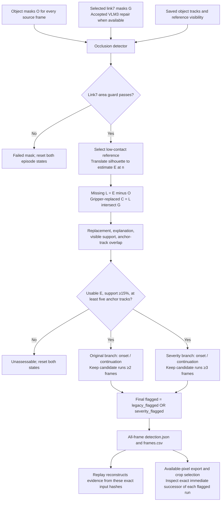

# Object occlusion: current detector and downstream cropping

Verified against the current code on **2026-10-03**. Method: **`gripper-occlusion-v2`**. All frame numbers are **zero based**. This guide covers mask quality, occlusion evidence, temporal flags, replay synchronization, and the handoff to crop selection.

Implementation: [occlusion.py](occlusion.py), [mask_quality.py](../perception/mask_quality.py), [occlusion_replay.py](occlusion_replay.py), and [mask_sync.py](mask_sync.py). The complete pipeline and exact VLM frame rules are in [the architecture guide](../../../docs/link7_object_masking_occlusion_cropping.md).

## What the detector answers

At source frame **n**, ask:

1. Where should the recently observed object silhouette be now?
2. Which pixels of that expected silhouette are absent from the current object mask?
3. How much of that missing region is occupied by link7?
4. Do the mask and track measurements persist sufficiently to flag an occlusion-risk episode?

The detector runs over **every source frame**, before choosing the ten crop pairs. It performs no VLM or SAM inference. It consumes the selected masks and saved object tracks.

The expected silhouette is an estimate of object support, not reconstruction of a hidden surface. A flag records substantial, persistent gripper-explained loss under the implemented rules; it does not prove a physical cause.

## Architecture



An accepted VLM3 repair must update the detector and replay together. Changing the visible overlay alone would leave crop-selection recovery frames based on the old masks.

## Three different pixel questions

Let **O[n]** be the current object mask, **G[n]** the selected link7 mask, and **E[n]** the expected silhouette, all on the same source-video pixel grid.

| Meaning | Pixel set | Purpose |
|---|---|---|
| Direct object/link7 overlap | `O AND G` | VLM3 overmask check, clean-reference check, crop eligibility |
| Expected pixels missing under link7 | `(E AND NOT O) AND G` | Occlusion evidence |
| Current available object pixels | `O AND NOT G` | Current crop alpha and frame-selection area |

These sets are not interchangeable. The **>95% VLM3 gate** divides direct overlap by current object-mask area. Occlusion replacement divides missing-under-link7 pixels by **expected silhouette area**. Direct overlap can reflect link7 leaking onto visible object pixels, so it cannot by itself start an occlusion episode.

## 1. Validate and align the inputs

The detector uses these case artifacts:

| Input | Native source |
|---|---|
| Object masks | `<object-root>/cases/<case>/masking/segmentation.npz`, `object_masks[:,0]`, named `task_object` |
| Selected link7 masks | `<gripper-root>/cases/<case>/v1_cotracker3/segmentation.npz`, `object_masks[:,5]`, named `link7` |
| Object tracks and visibility | Object case `score/cotracker_exact-group.npz`, the slice identified by `object_names` and `object_offsets` |
| Original source RGB | Object case `replay/source.mp4` |
| Gripper source provenance | Gripper case `base_segmentation_source.json` |

Masks must have identical `[T,H,W]` dimensions. Track coordinates and visibility must agree with the source frame count and image dimensions. The source-video hash must match gripper provenance. `detection.json` saves the input paths/hashes, actual configuration, detector-source hash, and source-video hash.

The shared **`link7-frame-area-v1`** guard fails a frame when true link7 mask area is **≥25% of the image**, using the configurable default `max_gripper_area_fraction=0.25`. This counts mask pixels, not bounding-box area. Equality fails.

A failed frame has `mask_valid=false`, `status="failed_link7_mask_area"`, no expected-mask measurement, and no candidate/flag. It supplies neither a reference nor replacement evidence and resets both candidate states. This is a mask failure, not a negative occlusion verdict. A small contaminated mask can still pass this size guard.

## 2. Select and maintain the expected silhouette

### Initial reference

Choose the **earliest** frame a satisfying all three conditions:

```text
link7 mask passes its area guard
object mask is nonempty
|O[a] intersect G[a]| / |O[a]| ≤ 5%
```

The tight binary crop of `O[a]` becomes the silhouette template. Frames before a are `insufficient_reference`, unless the mask guard independently fails them. If no such frame exists, no reference-based verdict is available.

This reference is independent of the **frame-0 RGB comparison** used for crop pairs. It may start later and refresh over time; the crop RGB reference remains frame 0.

### Placement at frame n

Translate the template near the centroid of current `O[n]`. The search rectangle extends approximately 1.5 template widths/heights on each side of that centroid, clipped to the image; its upper bounds add one pixel.

`cv2.matchTemplate(..., TM_CCORR)` selects the translation maximizing pixel evidence beneath the binary template:

- **+1** for current object pixels, including pixels also labeled link7;
- **0** for link7-only pixels;
- **−1** elsewhere.

The resulting full-image mask is **E[n]**. Its template shape and area are unchanged by placement: no scaling, rotation, dilation, or filled bounding box. An empty object mask or search region too small for the template gives `insufficient_visible_object` and resets both branches.

### Reference refresh

After evaluating n, set the reference/template to n for **subsequent** frames only when:

```text
direct current object/link7 overlap ≤ 5%
gripper-replaced expected fraction ≤ 5%
0.8 ≤ current object area / expected area ≤ 1.25
```

Otherwise keep the previous reference. Refresh is controlled by these mask conditions, not by track assessability; an `insufficient_support` row can still refresh the reference. Each row's saved `reference_frame` records the reference used to evaluate that row, before any refresh for later frames.

## 3. Measure missing pixels and track evidence

For a usable E:

```text
L = E AND NOT O                    expected pixels missing from O
C = L AND G                       missing pixels occupied by link7

lost_fraction       = |L| / |E|
occluded_fraction   = |C| / |E|    replacement of expected silhouette
explained_fraction  = |C| / max(|L|, 1)
visible_support     = |E AND O| / |E|
expected_contact    = |E AND G| / |E|
```

For example: E has 1,000 pixels; 400 are missing; 360 missing pixels lie under link7. Loss is **40%**, replacement is **36%**, and explanation is **90%**. These are spatial pixel counts after alignment, not simply a frame-to-frame decrease in scalar object area.

At reference frame a, an eligible object track must be **visible at a**, with its rounded coordinate inside `O[a] AND NOT G[a]`. This membership stays fixed until the reference changes.

```text
track_fraction = eligible tracks whose current coordinates land in G[n]
                 / max(number of eligible tracks, 1)

assessable = visible_support ≥ 15% AND eligible_track_count ≥ 5
```

Coordinates use `np.rint`; nonfinite or out-of-image points count as misses. **Current** visibility does not remove a track from the numerator or denominator. Visibility loss is not itself an occlusion trigger, and reference coordinates are not extrapolated using the silhouette translation.

A usable E with insufficient support/tracks gives `status="insufficient_support"`. Its pixel measurements remain available, but it cannot start or continue either candidate branch.

## 4. Build two independent temporal branches

These are current **defaults**; each audit records its actual `Config`.

| Decision | Conditions |
|---|---|
| Original/legacy onset | Assessable; replacement ≥20%; explanation ≥60%; track overlap ≥20% |
| Original/legacy continuation | Previous legacy candidate; assessable; total expected/link7 contact ≥20%; track overlap ≥20% |
| Severity onset | Assessable; replacement ≥20%; explanation ≥80%; **track overlap ≥10% OR replacement ≥50%** |
| Severity continuation | Previous severity candidate; assessable; replacement ≥20%; explanation ≥80% |

Per-frame state is:

```text
legacy_candidate[n] = legacy_onset[n] OR legacy_continuation[n]
severity_candidate[n] = severity_onset[n] OR severity_continuation[n]
```

The previous state is the **previous unfiltered candidate**, not a final flag. A failure resets that branch immediately. The two states are independent: a severity candidate cannot activate legacy continuation.

Legacy continuation permits object-mask regrowth because `E AND G` includes currently overlapping object pixels. Severity continuation still requires actual missing-under-link7 pixels, but no new track-overlap threshold. Both require assessability throughout.

Filter contiguous candidate runs independently:

```text
legacy_flagged   = legacy candidate runs lasting at least 2 frames
severity_flagged = severity candidate runs lasting at least 3 frames
flagged          = legacy_flagged OR severity_flagged
```

Keep **all** frames of a surviving run, including its initial frames. A severity run of three frames retains its first two; it does not start flagging only at frame three. There is no padding before onset, gap bridging, or combining two short runs from different branches to satisfy either branch's minimum.

Saved `onset` / `continued` describe the original branch. `severity_onset` / `severity_continued` describe the new branch. Each `continued` field is true only when continuation qualifies without onset. `candidate` is the union of the two unfiltered candidates; `flagged` is the union after independent run filtering.

## 5. Read the outputs and replay correctly

The case `occlusion/` directory contains:

| Artifact | Contents |
|---|---|
| `detection.json` | Configuration, hashes, all per-frame measurements/statuses/branch states, final intervals, failed-mask frames |
| `frames.csv` | Same per-frame audit as a table |
| `replay.html` | Frame-synchronized source video, reconstructed masks, replacement region, anchor-track evidence, and flags |

**Unflagged does not always mean assessed and free of occlusion.** Check `status` and `mask_valid`. Invalid masks, absent references, absent visible objects, or insufficient support all produce unflagged rows.

The replay verifies recorded object/gripper/track hashes, reconstructs E using the row's `reference_frame`, checks its area, and checks replacement against the audit. It does not run a different occlusion detector for display. Its replacement shading visualizes C; a shaded region can exist before temporal gates produce a final flag.

The accepted-mask handoff in `mask_sync.sync_case()` is:

```text
accepted VLM3 repair
→ replace only the named link7 channel in the selected archive
→ rerun occlusion using the prior saved configuration, or defaults if absent
→ regenerate the replay using that archive and new audit
→ re-export available pixels and frame-0 mappings
→ rerun ten-frame crop selection and its gallery
```

Original object masks, tracks, and source RGB are reused. Resume checks bind the handoff to the exact accepted repair and archive hashes. Cropping verifies its saved audit hash; a changed audit requires re-export before selection.

## 6. Hand off to available-pixel cropping

For a valid link7-area frame, the available mask is **`O[n] AND NOT G[n]`**. Invalid-area frames export an empty available mask. Full-frame RGB is used to extract these pixels; hidden pixels are not synthesized.

The occlusion audit serves two roles in the crop pipeline: its expected silhouette supports frame-0 shape mapping, and each **final flagged run** nominates its exact immediate successor for recovery reservation.

For `[start,end]`, inspect only **`end+1`**. Reserve it if it exists, is unflagged, has `status="assessed"`, and passes crop eligibility and the activated final-interval area gate. An unusable immediate successor is reported rather than moved to a later frame. A run reaching the last frame has no successor.

Ordinary crops do **not** require `flagged=false`: an occluded frame can still contain useful available pixels. Conversely, an empty/disappeared object can be unassessable and unflagged; that does not make a usable crop. Crop mapping, positive available/reference area, direct overlap ≤95%, interval ranking, and fallback still apply.

The normal ten-frame quotas are **0/2/2/2/4** across time quintiles. Eligible recovery successors are reserved before ordinary available-area ranking. Missing slots use the existing latest-interval fallback.

The **current** final-20% crop gate detects shrinking only: final mean must be below 50% of **both** the pooled first-80% mean and the 60–80% mean; then only individual final frames below 50% of the first-80% mean are excluded. The proposed >150% enlargement counterpart is documented in [§9.3 of the architecture guide](../../../docs/link7_object_masking_occlusion_cropping.md#93-final-interval-warning-and-selective-frame-rejection), but **has not been implemented**. Neither crop-area gate is an occlusion threshold.

Paired canvas normalization happens after extraction/mapping. It removes transparent margins and uses a shared canvas without resampling. It changes neither the native available-area measurements nor detector thresholds. Full original crop-source frames remain secondary click-through links in the crop gallery.

## 7. Why the severity branch exists, and its limits

The historical COSMOS3_0025 **frame 162** illustrates the added branch's purpose. In the original saved audit, its expected silhouette had 645 pixels; 359 were missing, and 344 of those lay in link7:

| Measurement | Value |
|---|---:|
| Visible support | 286 / 645 = 44.34% |
| Replacement | 344 / 645 = 53.33% |
| Loss explanation | 344 / 359 = 95.82% |
| Eligible reference tracks | 90 |
| Tracks currently inside link7 | 3 / 90 = 3.33% |

The original branch failed the 20% track gate despite strong mask replacement. Current severity onset can pass through **replacement ≥50%**, provided assessability and ≥80% explanation hold; the episode still needs three consecutive candidates. The saved v2 audit catches frame 162. These numbers describe the historical artifact with its selected mask inputs; replacing G requires recomputation, not reuse of that diagnosis.

The detector remains limited by segmentation quality and translation-only E. Rotation, scale changes, changing shape, reference contamination, and tracking drift can defeat the estimate. Object disappearance with no current mask cannot be aligned. A large replacement shaded region is evidence under the current masks, not ground-truth hidden-object geometry. Historical case screenshots and observations in [OCCLUSION_CASE_REVIEW.md](OCCLUSION_CASE_REVIEW.md) must be interpreted using their recorded input versions.

## Reproduce the detector and replay

From the repository root, using an environment with NumPy and OpenCV:

```sh
PYTHONPATH=PDI-Bench-edited/src python -m pdi_eval.object_deformation_wrapper.occlusion \
  --object-root <staged-object-root> \
  --gripper-root <selected-gripper-root> \
  --cases <case>

PYTHONPATH=PDI-Bench-edited/src python -m pdi_eval.object_deformation_wrapper.occlusion_replay \
  --root <staged-object-root> \
  --cases <case>
```

Use coherent staged masks, tracks, source video, and case artifacts. `--min-occluded-fraction` controls the shared replacement floor and legacy continuation contact threshold. `--min-explained-fraction` and `--min-track-fraction` configure the legacy onset/track rules. `--severity-min-explained-fraction`, `--severity-min-track-fraction`, and `--severity-min-occluded-fraction` configure severity explanation and its onset alternatives. `--max-gripper-area-fraction` configures mask validity. Other constants, including minimum run lengths, live in `Config`. An accepted VLM3 run normally invokes the synchronized handoff automatically.
