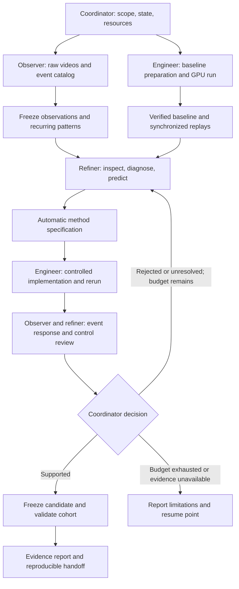

# Observation-led deformation research skill

Created 2026-10-08. Installed entry point: `/Users/nijiachen/Downloads/deformation-research-workspace/.agents/skills/deformation-research-loop/SKILL.md`.

The skill runs the complete research loop: inspect raw motion, collect specific deformation events and recurring patterns, execute a baseline, render and actually inspect synchronized 3D replays, diagnose the responsible stage, implement a reproducible refinement, and test it under matched conditions. It does not promise that every iteration finds an improvement.

## Three specialists and a coordinator

Observer and engineer start in parallel. The observer first receives raw videos, without detector scores. The refiner receives the frozen observation catalog and baseline intermediates, then can ask the engineer for extra instrumentation. Only the engineer schedules GPU work or edits experiment implementations. The coordinator maintains one authoritative state and decides whether the evidence supports another iteration.

The supporting Markdown files are executable role instructions in the sense that agents follow their inputs, procedures and handoff requirements; they are not a standalone job scheduler. They cover coordination, observation, experiments, replay inspection, refinement, shared records, and PDI integration.

## Preserve the origin of the method

The human-developed reference process came from Jiachen's observations: identify clear deformation positives, record specific changes, find recurring spatial patterns, run the naive Link5 PDI pipeline, return to those cases, inspect intermediate stages, and propose automatic measurements targeted to the recurring failure. AUROC was subsequent validation rather than the initial source of the refinement.

The user identified recurring deformation near Link5's middle narrow-to-wide transition and proposed increasing pair coverage there. This is the user's contribution. The discussion now calls that idea “refined v2”; existing ablation artifacts use `refine_v1`. Treat these as distinct labels until their code/configuration mapping is verified.

This historical target is deliberately absent from the installed discovery instructions. Reading this document, previous ablation reports, selector code, or the conversation contaminates a claim of independent rediscovery. A fresh agent that already receives the answer can still conduct a useful continuation, but cannot demonstrate independent discovery.

## First discovery trial

Use a new session and a clean baseline workspace containing raw videos, the requested mask inputs, the original baseline implementation, necessary model/cache provenance, and the installed skill. Keep existing refinements, ablation reports, this design note, and revealing screenshots outside that workspace. For strict isolation, restrict filesystem access; merely listing forbidden paths is procedural blinding.

The first trial should be narrow enough to finish: one initial baseline, one proposed refinement, a controlled pilot and a frozen cohort evaluation. The invocation supplies the cohort/mask manifest, baseline snapshot, connection and compute envelope. Reuse current authorization if those details were already supplied; otherwise prepare and inspect locally until missing execution details are resolved.

Suggested prompt for a fresh session:

> Use $deformation-research-loop in discovery mode on the supplied clean Link5/PDI baseline workspace. Use an observer, an experiment engineer, and a method refiner, with yourself coordinating. Begin with raw-video observation and collect specific deformation events and patterns before revealing baseline scores. Run the initial baseline, render synchronized replays, actually zoom and rotate their 3D views, diagnose the stage responsible for observed failures, and implement one reproducible refinement supported by the evidence. Use the supplied input manifest and GPU budget; use one H200 on Eris, starting from five concurrent videos and measuring stage capacity. Preserve originals and place trial code under robot/experiments and evidence under results. Validate event response and stable controls before cohort metrics. Do not read previous refinements or optimize toward a known selector. Finish with an accessible case report and reproduction commands, including negative results and unresolved cases.

Provide the actual baseline workspace, manifest and compute limits with that prompt. The prompt is a template, not a new authorization or an assertion that an allocation currently exists.

## What the first test should establish

Judge whether the agents produced independent, specific observations; inspected the real replay; diagnosed with intermediate evidence; specified an automatic rule rather than per-case edits; and ran a matched comparison with meaningful event response and control accounting. A different supported method can succeed. Matching the human pair budget or AUROC is not required.

The installed skill has no prewritten selector and launches no GPU job upon installation. A genuine end-to-end validation still requires running this trial with videos, an authorized GPU allocation and interactive replay access. Static checks and offline handoff tests cannot establish autonomous scientific rediscovery.

## Validation performed

- The skill-creator structural validator passed; all Markdown reference links resolve.
- An independent agent followed the installed skill on a synthetic continuation with higher event scores, different mask/XYZ inputs, increased stable-control response, missing raw visibility, and a rendered but uninspected replay. It correctly left selector effectiveness unresolved, identified the confounded comparison, preserved visibility uncertainty, required real replay inspection, and produced role-owned next actions and a resumable state without launching work.
- This checks evidence handling and handoffs, not visual competence, GPU execution or independent rediscovery. No actual deformation experiment was launched while creating the skill.
