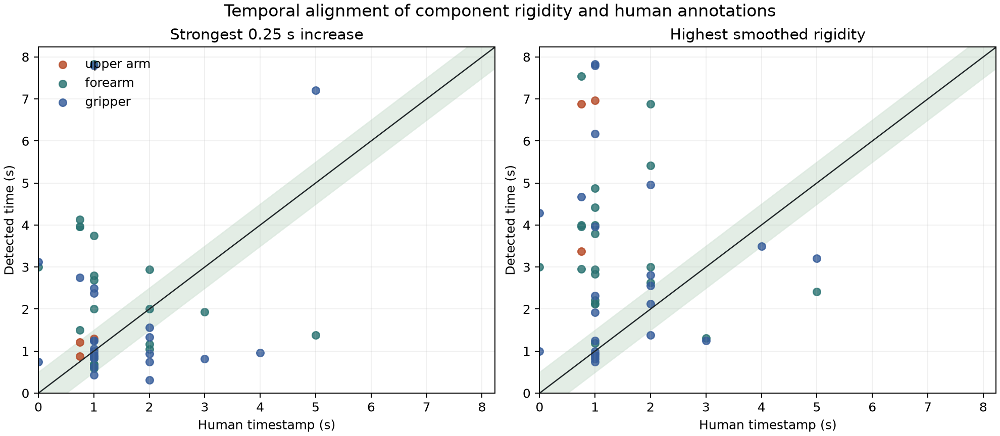

# Temporal Localization of Rigidity Surges

Generated: September 6, 2026

## Bottom line

There is evidence that the **onset-like increase** in rigidity occurs near the annotated deformation time more often than chance, but the rigidity score's **absolute peak usually does not**.

Across 48 quality-valid, component-matched timestamp events:

| Temporal test | Within 0.25 s | Within 0.5 s | Within 1.0 s | Median error |
|---|---:|---:|---:|---:|
| Strongest 0.25 s rigidity increase | 11/48 (22.9%) | **19/48 (39.6%)** | 27/48 (56.3%) | 0.89 s |
| Highest smoothed rigidity score | 9/48 (18.8%) | **10/48 (20.8%)** | 17/48 (35.4%) | 1.81 s |

The strongest increase was within 0.5 seconds in 39.6% of events, compared with a 19.6% circular-shift chance rate (`p = 0.0017`). The highest score was within 0.5 seconds in 20.8% of events, almost exactly its 19.6% chance rate (`p = 0.472`).

Therefore:

- A short-term rigidity **surge contains some genuine temporal information**.
- It is not accurate enough to say the surge is usually tightly localized: fewer than half of events match within 0.5 seconds.
- The final or maximum rigidity level is a poor timestamp estimator because it often peaks well after the annotated deformation onset.

## Cohort and timestamp coverage

The historical cohort contains 55 videos:

- 46 human-labeled robot-deformation positives
- 9 negative controls
- 32 positive videos with a component-specific, parseable timestamp
- 14 positive videos without a usable component timestamp

The 32 timestamped videos contain 55 component events: 31 gripper, 21 forearm, and 3 upper-arm events. Seven timestamped gripper events are excluded because `link7` has the historical `1.0` insufficient-evidence sentinel. This leaves **48 evaluable events from 30 videos**.

All 55 videos remain documented in the per-video output, including negatives and positives without timestamps.

## Timing alignment

The frame-to-time conversion was checked against the source videos on the AutoDL instance:

| Dataset | Videos | FPS | Frames | Duration |
|---|---:|---:|---:|---:|
| `LVP_ROBOWM` | 30 | 16 | 49 | 3.0625 s |
| `COSMOS3` | 25 | 24 | 189 | 7.875 s |

The rigidity history contains one value per source frame, so time is `frame_index / source_fps`.

## Surge definition

For each annotated component:

1. Upper arm is the mean of quality-valid `link2` and `link3` histories.
2. Forearm is the mean of quality-valid `link4` and `link5` histories.
3. Gripper is the quality-valid `link7` history.
4. A link is excluded when its stored final rigidity is the historical `1.0` insufficient-evidence sentinel.
5. The component history is smoothed with a centered 0.25-second moving average.
6. The detected surge is the largest increase in that smoothed score over the preceding 0.25 seconds.
7. The peak is the maximum smoothed rigidity after the reference frame.

The surge is the better onset test. The peak answers a different question: when the score reaches its highest absolute level.

## Chance comparison

Short videos make loose matching windows deceptively easy. For example, a ±1-second window covers most of a 3.06-second LVP clip. Raw hit percentages are therefore compared with 100,000 circular time shifts. Each permutation applies one random shift per video to preserve the timing relationship among components in that video while breaking alignment with the human annotation.

| Test | Window | Observed | Chance mean | Permutation p |
|---|---:|---:|---:|---:|
| Surge | ±0.25 s | 22.9% | 9.8% | 0.0075 |
| Surge | ±0.5 s | **39.6%** | 19.6% | **0.0017** |
| Surge | ±1.0 s | 56.3% | 38.7% | 0.0094 |
| Peak | ±0.25 s | 18.8% | 9.8% | 0.0357 |
| Peak | ±0.5 s | 20.8% | 19.6% | 0.472 |
| Peak | ±1.0 s | 35.4% | 38.6% | 0.760 |

The ±0.25-second peak result is nominally above chance, but it does not persist at the more realistic ±0.5- and ±1-second windows. Because several windows and component subsets are tested, these p-values are exploratory and are not corrected for multiple comparisons.

## Component results

| Component | Events | Surge within 0.5 s | Chance | p | Peak within 0.5 s | Chance | p |
|---|---:|---:|---:|---:|---:|---:|---:|
| Upper arm | 3 | 3/3 (100.0%) | 12.8% | 0.0021 | 0/3 (0.0%) | 12.7% | 1.000 |
| Forearm | 21 | 6/21 (28.6%) | 18.8% | 0.183 | 1/21 (4.8%) | 18.9% | 0.989 |
| Gripper | 24 | **10/24 (41.7%)** | 21.1% | **0.014** | **9/24 (37.5%)** | 21.1% | **0.044** |

### Upper arm

All three timed upper-arm events have the strongest increase within 0.5 seconds, with a median error of 0.29 seconds. However, all three are `COSMOS3` videos (`0042`, `0047`, and `0048`). This sample is too small to establish reliable upper-arm localization. Their absolute rigidity peaks occur 2.63 to 6.13 seconds away from the annotations.

### Forearm

Forearm localization is weak. The strongest increase is within 0.5 seconds for only 6 of 21 events, not significantly better than chance. The absolute peak is especially poor: only 1 of 21 peaks is within 0.5 seconds, below the chance expectation.

This matches the earlier forearm diagnosis. `link4` is frequently unavailable, `link4` and `link5` disagree, and per-link rigidity cannot represent some labeled changes such as uniform shortening or abnormal joint articulation.

### Gripper

The gripper provides the clearest temporal signal. Its strongest increase is within 0.5 seconds for 10 of 24 events, approximately twice the chance rate. Its absolute peak also performs better than chance at 0.5 seconds, although the evidence is weaker.

Seven additional gripper timestamps cannot be evaluated because `link7 = 1.0` denotes insufficient evidence rather than a temporal measurement. Therefore, the gripper result applies only to quality-valid histories.

## Dataset results

| Dataset | Events | Median surge error | Surge within 0.5 s | Chance | p | Peak within 0.5 s | p |
|---|---:|---:|---:|---:|---:|---:|---:|
| `LVP_ROBOWM` | 20 | 0.66 s | 45.0% | 29.6% | 0.116 | 35.0% | 0.364 |
| `COSMOS3` | 28 | 1.17 s | 35.7% | 12.4% | 0.0032 | 10.7% | 0.706 |

The COSMOS3 surge alignment is clearly above its lower chance rate because those clips are longer. In the short LVP clips, a 0.5- or 1-second window covers a large fraction of the video, so the observed hit rate is not distinguishable from chance.

## Why the surge and peak disagree

1. A deformation event can cause an immediate score increase, followed by a larger tracking or reconstruction artifact later in the video.
2. Persistent deformation may begin near the annotation but continue increasing, placing the maximum well after onset.
3. The per-frame evaluator can carry the previous score forward when too few pairs are visible, shifting or flattening the apparent peak.
4. Track drift and later sampling outside the original link mask can create delayed high rigidity unrelated to the labeled deformation.
5. A centered smoothing window and approximate human timestamps limit precision below roughly 0.25 to 0.5 seconds.

The onset-like increase is therefore more meaningful for temporal localization than either the final video average or the global score maximum.

## Interpretation

The temporal evidence is stronger than the video-level upper-arm and forearm correlations alone suggest, but it is localized mainly in the gripper and in a small set of upper-arm examples.

A defensible summary is:

> Quality-valid per-frame rigidity often rises near a human-marked deformation event more frequently than expected by chance, but the localization is incomplete. The strongest short-term increase falls within 0.5 seconds for 39.6% of evaluable component events, versus 19.6% by chance. The absolute rigidity maximum is not temporally aligned. Gripper rigidity carries most of the repeatable timing signal; forearm localization remains near chance, and only three timed upper-arm examples are available.

This supports using a temporal change feature, such as maximum short-window increase, as an additional diagnostic. It does not support using the global rigidity peak as the deformation timestamp.

## Outputs

- All 55 videos: [`data/temporal_localization_55_videos.csv`](data/temporal_localization_55_videos.csv)
- Component event results: [`data/temporal_localization_events.csv`](data/temporal_localization_events.csv)
- Machine-readable statistics: [`data/temporal_localization_summary.json`](data/temporal_localization_summary.json)
- Reproducible analysis: [`../scripts/analyze_temporal_rigidity_localization.py`](../scripts/analyze_temporal_rigidity_localization.py)

## Annotation caveats

- `COSMOS3_0014` contains an ambiguous second gripper value written as `05`; only the unambiguous 1-second event is used.
- `LVP_ROBOWM_0031` is structured as upper-arm positive, but its note says forearm deformation at 1 second. It is excluded from component-matched localization rather than silently reassigned.
- `LVP_ROBOWM_0045` is upper-arm positive but has no timestamp.
- Notes saying “second half of sec0” are represented by 0.75 seconds.
- Human timestamps are approximate and were not independently re-annotated from the source video.
