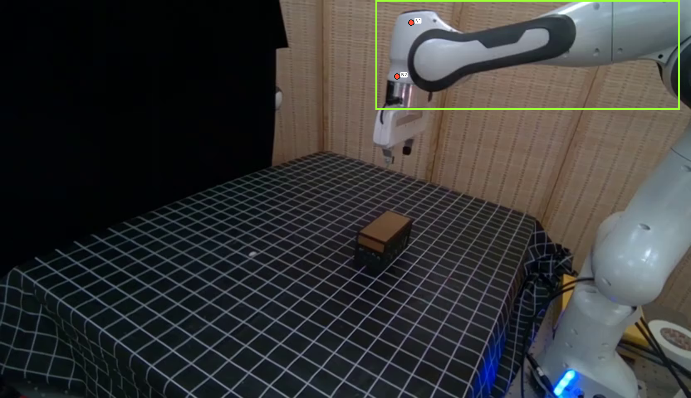
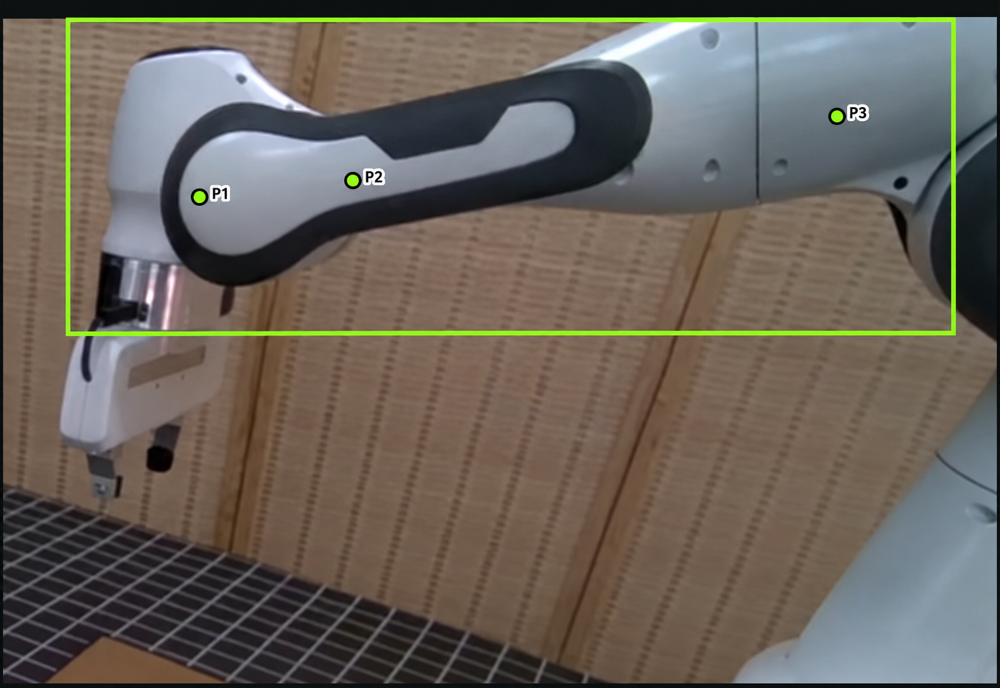

# How the current Link5 guard works

**The guard chooses five points for the forearm mask: three green points to include the forearm, and two red points to exclude the adjacent wrist.** Production requires usable negative and positive answers before final point prompting and video propagation.

**Flow:** frame 0 and green box → check N1/N2 → place P1/P2/P3 → five-point SAM3 prompt → propagate the mask through the video.

This report describes the current production code as of October 8, 2026.

## 1. What the VLM sees

Each review receives **Image 1: the fixed reference below**, and **Image 2: the current full video frame**, with its green box and proposed points. References stay fixed across videos and retries.

Localization supplies the box. P2, P3, N1 and N2 start at fixed positions relative to it. **P1 has no initial coordinate or fallback.**

### Negative reference: exclude the white wrist



Unchanged saved VLM input, verified against the current code. Both negative-review images show only red N1/N2.

### Positive reference: include the white forearm



The guard uses this existing reference directly. The **current-frame** image shows proposed P2/P3 only, with no P1 proposal.

## 2. Negative guard: keep good points, otherwise replace both

The VLM checks that both centers lie on white wrist material, outside the forearm and black border. Background, collar and gripper are wrong. A center on wrist material can pass even near the silhouette.

- If both points are good, return `PASS` and keep them.
- Otherwise, replace both: N1 on the upper white wrist cap, N2 on the left white housing, safely inside the wrist and left of the black forearm rim.

The correction answer must be:

```json
{"decision":"REJECT","negative_points_xy":[[n1x,n1y],[n2x,n2y]]}
```

**Only N1 must be inside the green box, allowing 5 original-frame pixels beyond its boundary.** N2 may be outside. This check also runs on `PASS`.

“N1 above and slightly left of P1” is **not** a separate code check; anatomy is judged by the VLM.

## 3. Retry: three total negative calls

Retry happens for **N1 outside the allowed box** or **an unusable answer**: bare `REJECT`, malformed JSON, wrong fields, missing or invalid coordinates.

Every retry uses **identical images and prompts**. Failed points are never applied or used as the next proposal.

**Three total calls, including the first.** Exhaustion stops the case before positive placement; the coordinator cannot restart this exhausted stage and multiply the budget. API errors/missing responses follow the existing robot failure policy instead.

## 4. Positive guard: the VLM supplies all three coordinates

| Point | Required location |
|---|---|
| P1 | Just inside the left edge of the rounded pale lobe enclosed by the black border, with visible pale material between the point and rim. |
| P2 | Farther right on the pale inset, inside the black border. |
| P3 | On the right white forearm panel, after the black inset and before the circular joint. |

The VLM places P1, keeps valid P2/P3 and moves invalid ones. It must return all three:

```json
{"decision":"PLACE","positive_points_xy":[[p1x,p1y],[p2x,p2y],[p3x,p3y]]}
```

`PASS` is invalid because it supplies no P1. There is **one positive call per invocation**; failures use existing coordinator retry/fallback handling, without a new three-call positive loop.

## 5. What the code validates—and what the VLM judges

Coordinates must be integers inside the original full frame, measured from top-left `(0,0)`, before display enlargement. Returned points must be at least 8 pixels apart and cannot coincide with fixed points outside that review.

**Material and anatomy are VLM judgments.** The parser does not verify wrist/forearm material or require positives inside the box.

Default: Gemini 3.8 Flash, high reasoning. Existing fallback: GPT-6 Luna, xhigh reasoning. Negative-only testing freezes positives; production runs both reviews.

## 6. How to read the saved result

Saved evidence: reference/current images, selected-point image and `link5_guard.json` with prompts, replies, attempts and box checks.

**`REJECT` with coordinates means “use these corrected points.”** Even successful positive placement can produce an overall `REJECT` record. Check individual reviews and failure fields. Bare `REJECT` is unusable.

Code: [guard and exact prompt text](link5_point_guard.py), [production adapter](../../workflows/coordination.py), [SAM3 integration](../segmentation/sam3_dinov2_segment.py), [coordinator failure handling](../../../infrastructure/deformation_detect/coordinator.py).
